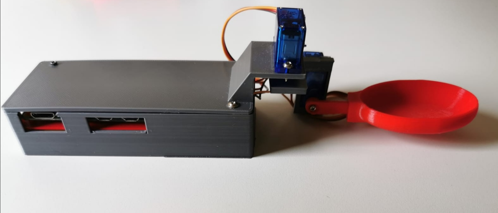
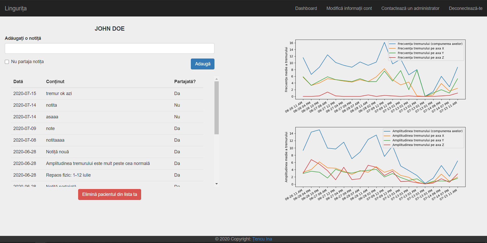

# Self Stabilizing Spoon

| | |
| - | - |
|     This project consists of a hardware device - a self-stabilizing electronic cutlery - which helps people suffering from hand tremor to eat more efficiently, and a web application created to deliver statistics to the doctors about the evolution of each patient's tremor.     |  &nbsp;&nbsp;&nbsp;&nbsp;&nbsp;&nbsp;&nbsp;&nbsp;&nbsp;&nbsp;&nbsp;&nbsp;&nbsp;&nbsp;&nbsp;&nbsp;&nbsp;&nbsp;&nbsp;&nbsp;&nbsp;&nbsp;&nbsp;&nbsp;&nbsp;&nbsp;&nbsp;&nbsp;&nbsp;&nbsp;&nbsp;&nbsp;&nbsp;&nbsp;&nbsp;&nbsp;&nbsp;&nbsp;&nbsp;&nbsp;&nbsp;&nbsp;&nbsp;&nbsp;&nbsp;&nbsp;&nbsp;&nbsp;&nbsp;&nbsp;&nbsp;&nbsp;&nbsp;&nbsp;&nbsp;&nbsp;&nbsp;&nbsp;&nbsp;&nbsp;&nbsp;&nbsp;&nbsp;&nbsp;&nbsp;&nbsp;&nbsp;&nbsp;&nbsp;&nbsp;&nbsp;&nbsp;&nbsp;&nbsp;&nbsp;&nbsp;&nbsp;&nbsp;&nbsp;&nbsp;&nbsp;&nbsp;&nbsp;&nbsp;|

## The hardware component

| | |
| - | - | 
| The electronic cutlery is based on a Raspberry Pi (the brain of the hardware assembly), an orientation sensor, consisting of a module with accelerometer and gyroscope, which provides information on the position and movement of the handle, and two servo motors that deal with effective stabilization of the spoon cavity. |  |
## The web application

The web application aims to continuously inform doctors about the condition of patients who use the hardware device, providing them statistics on the evolution of each patient's disease, using the data collected by the cutlery. The chosen framework for the web application was "Flask" which is written in the programming language called "Python".  
The web application is designed to bring new functionalities to the cutlery, it is not mandatory to use both components. Thus, users with no internet access do not have to configure the hardware device in any way in order to be able to use its main function, namely to minimize the effect of tremor.  

If the two components are used together, the use of the hardware device proceeds as follows: at the beginning of each meal, when the patient starts the cutlery, data is read and saved for 40 seconds, without effective stabilization. Afterwards, the data is sent from the cutlery to the web server, and the cutlery begins to stabilize the attached utensil. Upon receiving the information, the server saves the data and updates the tremor statistics of that patient, so that they can be later delivered to his doctors.
